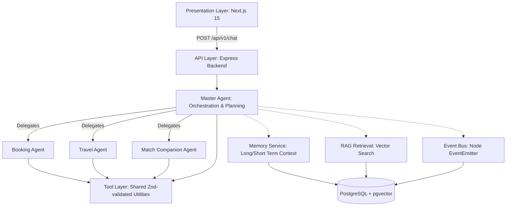

# Architecture

This document serves as the system design specification for the FIFA AI Companion project, superseding previous system designs and outlining the execution framework.

---

## 1. Core Principles

The design of the FIFA AI Companion is centered around the following:

1.  **Single Chat Interface:** The user never directly chooses or interacts with individual agents. All queries—whether they relate to seat booking, flight schedules, matches, or local advice—go through a single chat interface served by the **Master Agent**.
2.  **Encapsulation of Details:** Specialized agents (Booking Agent, Travel Agent, Match Companion Agent) and custom tools are implementation details that are invisible to the user. The presentation layer handles a uniform API contract.
3.  **Explicit Context & Grounding:** parametric knowledge is supplemented by a dedicated RAG (Retrieval-Augmented Generation) layer that retrieves real data (such as venue specifications, FAQs, city guides) to ground agent actions and minimize hallucination risks.
4.  **Decoupled Events:** Inter-agent operations are driven by an in-process Event Bus to decouple features and allow extensions without altering core agent logic.

---

## 2. Layered System View

The system architecture consists of the following layers:

---

## 3. Key Components

### 3.1 Presentation Layer (Next.js 15)
*   **Purpose:** Renders the user-facing web application, onboarding wizard, match dashboard, travel itinerary, and digital tickets.
*   **Technologies:** React 19, TypeScript, Tailwind CSS, and shadcn/ui.
*   **API Interactivity:** Powered by a single endpoint (`POST /api/v1/chat`) to send messages and receive unified answers alongside transaction payloads.

### 3.2 API Layer (Express Backend)
*   **Purpose:** Exposes gateway APIs, runs role-based access checks, manages user authentication, and coordinates non-conversational reads/writes (e.g., direct dashboard loading).
*   **Validation:** Environment and request schemas are strictly validated via Zod.

### 3.3 Master Agent
*   **Purpose:** Serves as the primary planner and router.
*   **Workflow:**
    1.  Loads memory context (long-term preferences + rolling window history).
    2.  Fetches grounding documents from the RAG layer.
    3.  Classifies intent and performs function-calling classification to select specialized downstream agents (or tools) as required.
    4.  Delegates queries, merges agent responses, writes memory updates, publishes domain events, and responds to the user.

### 3.4 Specialized Agents
*   **Booking Agent:** Responsible for seat search, locks, payments, and ticket generation. Employs `SERIALIZABLE` database transactions to guarantee lock isolation.
*   **Travel Agent:** Assembles custom hour-by-hour itineraries based on travel preferences and match times.
*   **Match Companion Agent:** Generates live commentary and match stories by analyzing statistical feeds and user preferences.

### 3.5 RAG Retrieval Layer
*   **Embedding Dimension:** **768 dimensions** (aligned with the Gemini Pro embedding model).
*   **Storage:** Powered by PostgreSQL with the `pgvector` extension to perform cosine similarity searches.

---

## 4. Provider Assignment

To ensure predictability and cost management:
*   **Master Agent:** Gemini Pro (for planning, routing, classification).
*   **Booking / Travel Agents:** Gemini Pro (for structured tool execution).
*   **Match Companion Agent:** Gemini Pro (for consistent summaries).
*   **Multi-Provider Fallback:** OpenAI is kept as a documented fallback option to prevent quota blocks.
