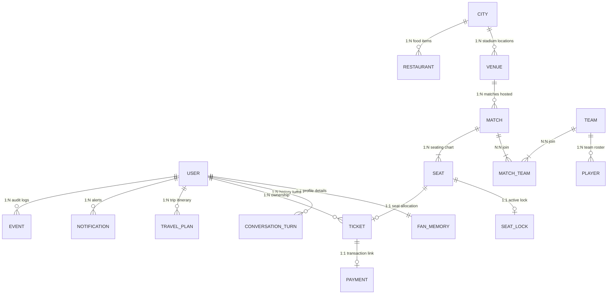

# Database Documentation

The FIFA AI Companion uses a PostgreSQL database mapped via Prisma ORM. It enables the `pgvector` extension directly in Postgres to support high-performance vector search calculations for RAG grounding.

---

## 1. Extension & Vector Settings

*   **Extension:** `pgvector` mapping to `vector` in PostgreSQL.
*   **Dimensions:** **768 dimensions** configured on `KnowledgeChunk.embedding`. This matches the vector output shape of the **Gemini Pro** text embedding models (e.g. `text-embedding-004`), reducing size constraints relative to 1536-dimensional engines while maintaining context.

```prisma
datasource db {
  provider   = "postgresql"
  url        = env("DATABASE_URL")
  extensions = [pgvector(map: "vector")]
}
```

---

## 2. Entity Models & Schema

### 2.1 User & Onboarding
*   `User`: Represents login profiles. Has a `role` field gates system routes ("Fan" vs "Admin").
*   `FanMemory`: Stores long-term fan DNA profile data (e.g., `favoriteTeam`, `favoritePlayers`, `budget`, `accessibilityNeeds`). It maps **1-to-1** with the `User` model, serving as the single point of truth for user preferences.

### 2.2 Conversations
*   `ConversationTurn`: Short-term memory. Stores a rolling list of conversation logs (role, message, timestamp, agent used) linked **1-to-N** with the `User`. Double-functions as a conversational audit trail.

### 2.3 Match Structures
*   `City`: Holds host city records.
*   `Venue`: Stadium details linked to a `City`. Includes an `info` field containing raw descriptions for RAG chunks.
*   `Team` & `Player`: Seeded team rosters.
*   `Match`: Links to a `Venue` and lists participating teams via the N-to-N join table `MatchTeam`.
*   `Seat`: Represents specific locations within a stadium for a `Match`. Contains section, row, seat number, and price records.
*   `SeatLock`: A temporary lock on a `Seat` during ticket booking, containing an expiry timestamp (`expiresAt`).

### 2.4 Transactions & Operations
*   `Ticket`: A purchased ticket linking `User` and `Seat`. Contains a `qrCode` signature field for security verification.
*   `Payment`: Tracks transaction states ("Pending", "Succeeded", "Failed") and records Stripe identifiers.
*   `TravelPlan`: Stores full trip travel itineraries as a single `Json` blob.
*   `Notification`: Outlines user alert logs.
*   `Event`: An audit event logging service occurrences (e.g., `BookingCompleted`, `PaymentFailed`) for analytics and event bus triggers.

### 2.5 RAG Ingestion
*   `KnowledgeChunk`: Houses vector data:
    *   `sourceType`: Source classification (e.g. `VenueInfo`, `HostCityGuide`, `FifaFAQ`).
    *   `title` & `content`: Clear-text grounding data.
    *   `metadata`: Json details.
    *   `embedding`: Vector data type `Unsupported("vector(768)")?`.

---

## 3. Entity ER Relationship Diagram


